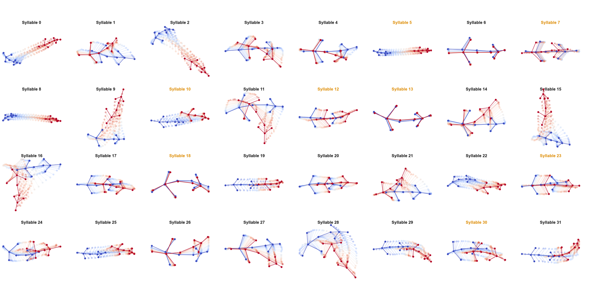

# Social Context Restructures Behavioral Syntax in Mice

## Abstract
The study of social behavior in mice has grown increasingly relevant for unraveling associated brain circuits and advancing the development of treatments for psychiatric symptoms involving social withdrawal or social anxiety. However, a data-driven understanding  of behavior and its modulation in solitary and social contexts is lacking. In this study, we employed motion sequencing (“MoSeq”) to decompose mouse behaviors into discrete units (“Syllables”) and investigate whether—and how—the behavioral repertoire differs between solitary and dyadic (social) settings. 

Our results reveal that social context significantly modulates a minority (25%) of syllables, containing predominantly stationary and undirected behaviors. Notably, these changes are associated with spatial proximity to another mouse rather than active social contact. Interestingly, a network analysis of syllable transitions shows that context-sensitive syllables exhibit altered network influence, independent of the number of connected syllables, suggesting a regulatory role. Furthermore, syllable composition changes significantly during social contact events with two distinct sequence families governing approach and withdrawal behaviors. However, no unique syllable sequences mapped to specific social interactions. 

Overall, our findings suggest that a subset of syllables drives contextual behavioral adaptation in mice, potentially fascilitating transitions within the broader behavioral repertoire. This highlights the utility of MoSeq in dissecting nuanced, context-dependent behavioral dynamics.

## Related files
The preprint can be found at https://www.biorxiv.org/content/10.1101/2025.04.17.648924.

The necessary data can be found at https://doi.org/10.5281/zenodo.15237564.
The root_dir variable in each notebook needs to be changed to the location of the data root dir.
